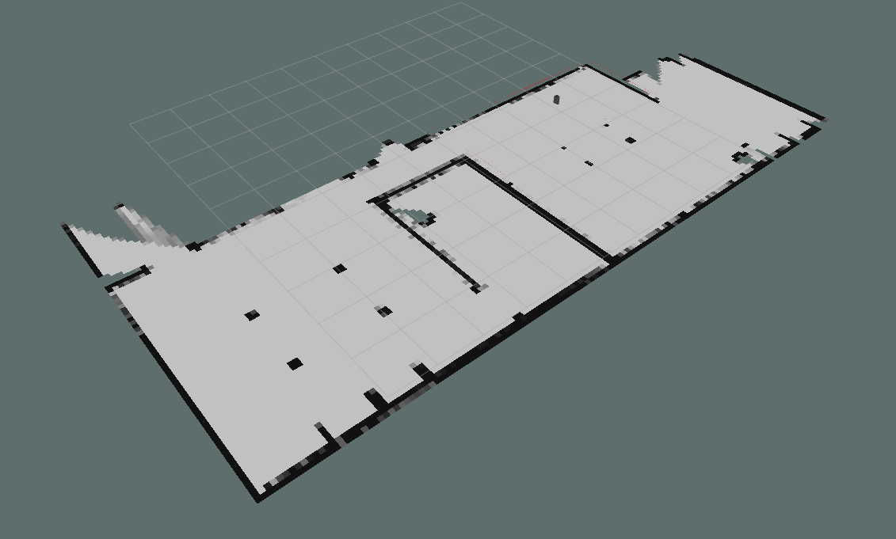
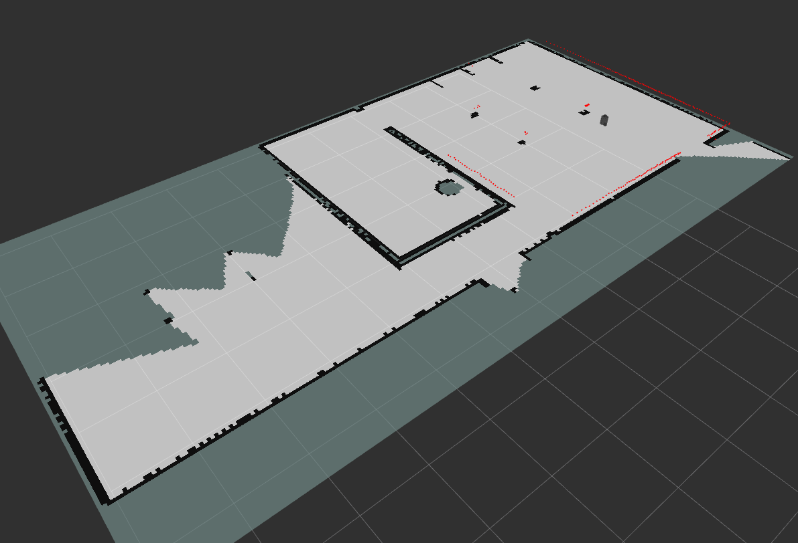
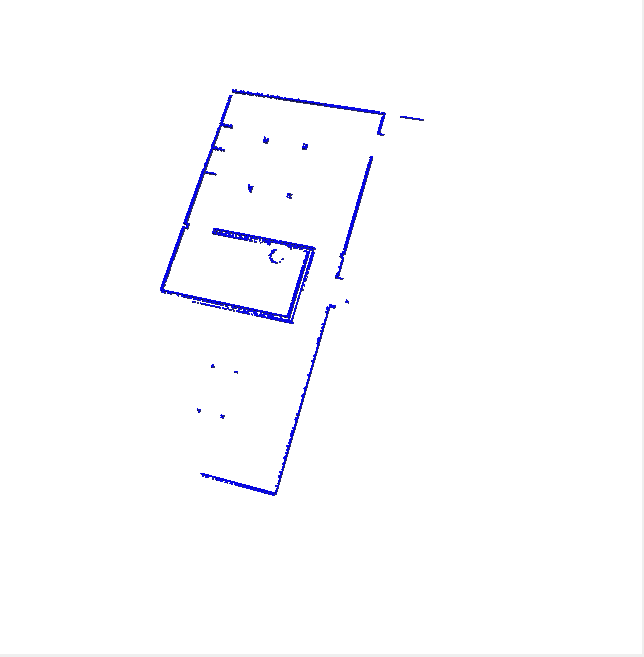
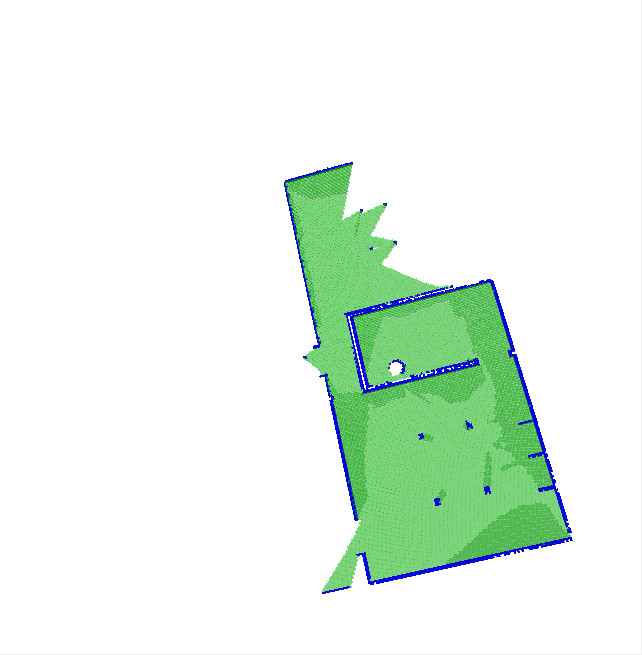

# Hands on Planning
## Lab 1 - Occupancy Grid Map using Bresenham Algorithm
&nbsp;

**Group Members:**

- Nafees Bin Zaman: u1977526
- Mahmuda Rawnak Jahan: u1977525
&nbsp;

To visualize the simulation environment in Gazebo and Rviz, please execute the turtlebot3.launch file. To execute the launch file, please copy and paste the following command given in the code snippet into the terminal.
&nbsp;

*roslaunch <package_name> <launch_file>*

```
roslaunch mapping_nafees_mahmuda turtlebot3.launch
```
&nbsp;

Next, to publish the occupancy gripmap, please execute the gridmap_server_node.py file. To execute the node, please copy and paste the following command given in the code snippet into another terminal. 
&nbsp;

*rosrun <package_name> <node_file>*

```
rosrun mapping_nafees_mahmuda gridmap_server_node.py
```
&nbsp;

Similarly, for octomap_server use the following commands:

```
roslaunch mapping_nafees_mahmuda octomap.launch
```

```
rosrun mapping_nafees_mahmuda laser_scan_to_point_cloud_node.py
```
&nbsp;

**Output - Occupancy Grid Map**



&nbsp;

**Output - Octomap Server**




&nbsp;

**Output - Octomap in Octoviz**

The following images are produced through Octoviz. To generate the map in octoviz, we have used the given commands in the lab pdf.

<p float = "left" >
  
  
</p>


<h2 align="center">Thank You</h2>
&nbsp;
